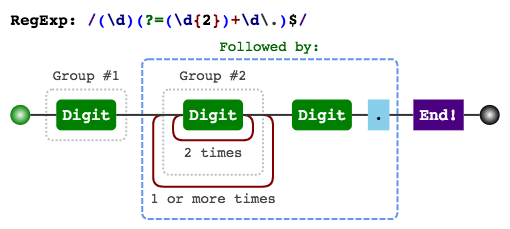

Formatting a number in JavaScript can be as simple as `toLocaleString()`,  but while working on a side project, I came across a scenario where  neither `toLocaleString()`  nor `toFixed()` was enough.

I wanted the numbers to be in `XX,XX,XXX.XX` format. So, I tried bunch of different methods.

```javascript
(254.4).toLocaleString() // "254.4"

(1234567.8).toLocalString() // "1,234,567.8"

(1234567.8).toFixed(2) // "1234567.80"

Number((1234567.8).toFixed(2)).toLocaleString() // "1,234,567.8"
```

As you can see that none of the methods worked as per my requirements.


After some googling and tinkering around with `RegExp`s, I finally found a solution.

```javascript
(1234567.8).toFixed(2).replace(/(\d)(?=(\d{2})+\d\.)/g, '$1,') // "12,34,567.80"
```

The above solution works flawlessly as per my requirements. Basically the regex looks for a digit which is followed by digits (in groups of two) followed by a digit and a decimal point.



<!--{.img-center}-->

*(Image generated using [Regulex](https://jex.im/regulex/))*